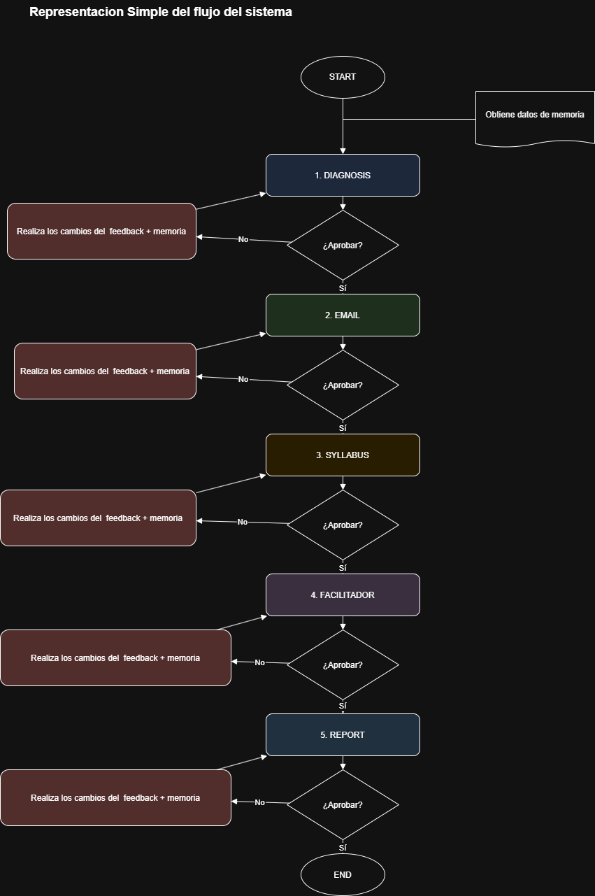
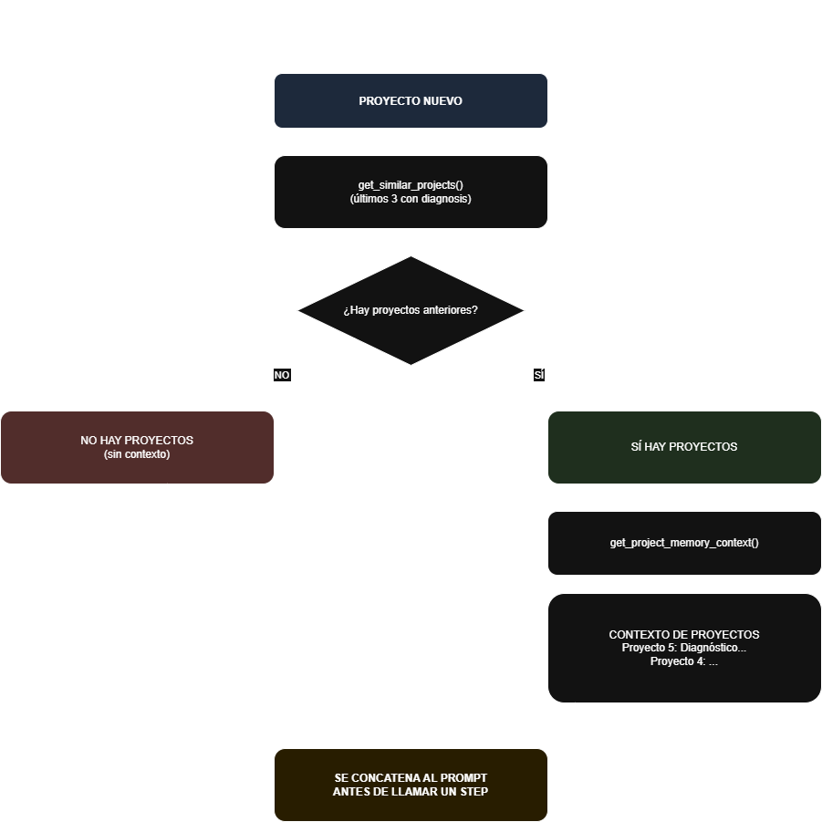
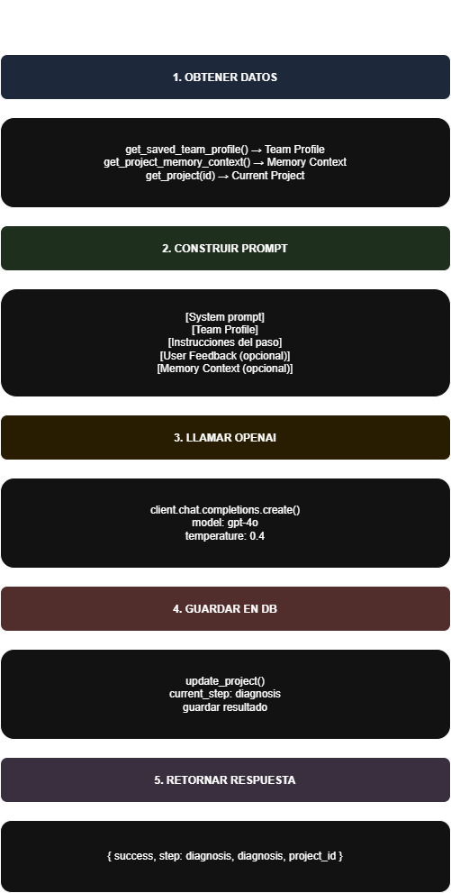

# Agente IA Kometa - Reto C

Proyecto de prueba técnica para Kometa - Inteligencia Artificial

## Descripción

Agente IA que simula el rol de un Decano Académico para VentaMax S.A.S. Ejecuta un workflow de 5 pasos:
1. **Diagnóstico** - Análisis del equipo de ventas
2. **Correo** - Convocatoria al programa de formación
3. **Syllabus** - Contenido del programa (6+ módulos)
4. **Facilitadores** - Asignación de facilitadores
5. **Reporte** - Métricas y seguimiento

## Características

- Interactivo (aprobar/rechazar cada paso)
- Memoria de proyectos anteriores
- Perfil del equipo (editable)
- Persistencia en SQLite
- Integración con OpenAI GPT-4o  

---

## Instalación

### Requisitos Previos

| Software | Versión |
|----------|---------|
| Python | 3.10+ |
| Node.js | 18+ |
| Git | cualquiera |
| OpenAI API Key | [Obtener aquí](https://platform.openai.com/api-keys) |

<!--Conseguir API Key de OpenAI:-->
<!--1. Ir a https://platform.openai.com/-->
<!--2. Crear cuenta o iniciar sesión-->
<!--3. Ir a "API Keys" en el menú-->
<!--4. Click en "Create new secret key"-->
<!--5. Copiar la clave y pegarla en el archivo .env-->

### Backend

```bash
# 1. Entrar a la carpeta backend
cd backend

# 2. Instalar dependencias
pip install -r requirements.txt 
# fastapi, uvicorn, python-dotenv, openai, pydantic

# 3. Configurar variable de entorno
# Crear archivo .env con tu API key de OpenAI:
# OPENAI_API_KEY=sk-tu-api-key-aqui
# Puedes eleminar .env.example y crear tu .env

# 4. Ejecutar el backend
uvicorn app.api.agente_API:app --reload
```

### Frontend

```bash
# 1. Entrar a la carpeta frontend
cd frontend

# 2. Instalar dependencias
npm install

# 3. Ejecutar el frontend
npm run dev
```

---

## Estructura del Proyecto

```
Reto-C-Jean/
├── .gitignore                    # Archivos ignorados por Git
├── README.md                     # Este archivo
│
├── backend/                      # Backend - FastAPI
│   ├── .env.example              # Ejemplo de archivo .env
│   ├── requirements.txt          # Dependencias Python
│   ├── data.db                   # Base de datos SQLite
│   └── app/
│       ├── agent/
│       │   └── agente_ia.py     # Lógica del agente (workflow, steps, memoria)
│       └── api/
│           └── agente_API.py    # Endpoints de la API
│
├── frontend/                     # Frontend - Next.js 15
│   ├── package.json              # Dependencias Node
│   ├── next.config.ts            # Configuración de Next.js
│   ├── tsconfig.json             # Configuración de TypeScript
│   └── src/
│       └── app/
│           ├── page.tsx          # Componente principal (UI)
│           ├── layout.tsx        # Layout de la aplicación
│           └── globals.css       # Estilos CSS
│
└── docs/                         # Documentación
    ├── Workflow.png             # Diagrama visual del workflow
    ├── Pipeline_Steps.png       # Diagrama de los pasos del agente
    ├── Memoria_agente.png      # Diagrama del sistema de memoria
    └── reto_jean_carlo.pdf     # PDF original del reto
```


---


## Stack Tecnológico

- **Backend**: FastAPI (Python)
- **Frontend**: Next.js 15 (React)
- **IA**: OpenAI GPT-4o
- **Persistencia**: SQLite
- **Estilos**: CSS

---

## Resumen del flujo Agente IA





El agente ejecuta un workflow secuencial de 5 pasos donde cada uno genera contenido específico:
1. **Diagnóstico**: Analiza el perfil del equipo y detecta brechas de conocimiento
2. **Email**: Redacta correo de convocatoria con asunto, destinatario y cuerpo
3. **Syllabus**: Diseña programa formativo con 6+ módulos (nombre, duración, descripción, objetivos, metodología)
4. **Facilitadores**: Asigna facilitadores internos a cada módulo del programa
5. **Reporte**: Genera reporte final con métricas simuladas de participación y logro

El usuario interactúa aprobando o rechazando cada paso, con opción de agregar feedback para regenerar contenido.


---

## Resumen flujo de memoria 




El sistema de memoria permite al agente recordar proyectos anteriores:
- **Al generar un nuevo paso**, consulta la base de datos buscando proyectos anteriores con contenido
- **Contexto**: Toma los últimos 3 proyectos y extrae sus diagnósticos, syllabi y facilitadores
- **Prompt**: Concatena este contexto al prompt antes de llamar a OpenAI
- **Beneficio**: El modelo tiene referencia de trabajos previos, permitiendo coherencia yvariedad en las respuestas

Esta memoria es acumulativa: cada nuevo proyecto puede aprovechar el conocimiento de los anteriores y mejorando respuestas.

---

## Resumen funcion Steps (Email, Syllabus, Facilitadores, Reporte)





### Step 1 - Diagnóstico
Analiza el perfil del equipo de ventas proporcionado y detecta las brechas de conocimiento más importantes, identificando: fortalezas del equipo, brechas identificadas (mínimo 5), áreas críticas a mejorar y recomendaciones de formación.

### Step 2 - Email
Genera correo de convocatoria completo con: asunto atractivo, saludo formal, introducción sobreimportancia de la formación, beneficios para el equipo, fechas sugeridas, llamado a la acción y firma "Equipo de Formación VentaMax".

### Step 3 - Syllabus
Diseña programa de formación con MÍNIMO 6 módulos que incluyen: nombre del módulo, duraciónen horas, descripción breve, objetivos de aprendizaje y metodología a utilizar.

### Step 4 - Facilitadores
Asigna un facilitador interno a cada módulo basándose en perfiles predefinidos (María González, Carlos Ruiz, Ana Martínez, Pedro Suárez, Laura Chen) y justifica la elección.

### Step 5 - Reporte
Genera reporte ejecutivo final que incluye: resumen ejecutivo, métricas de participación(simuladas), métricas de logro esperadas, próximos pasos e indicadores de éxito.


---

## Notas Adicionales

- El proyecto usa **SQLite** (no requiere instalación de base de datos)
- La API key de OpenAI es necesaria para que el agente funcione
- El perfil del equipo se puede editar desde la interfaz
- Los proyectos se guardan automáticamente en la base de datos

---

## Autor

Jean Carlo Sanchez Parra- Reto C